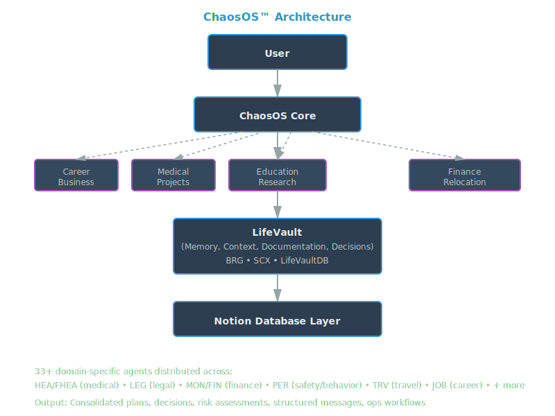

## Overview

ChaosOS™ is an operational intelligence framework designed to organize complex information, preserve context, and transform fragmented knowledge into structured action.

Rather than organizing work by applications or documents, ChaosOS organizes information around decisions. It combines knowledge management, workflow design, AI-assisted reasoning, and operational thinking into a single architecture capable of supporting healthcare advocacy, financial planning, business operations, education, career development, relocation research, and other complex domains.

Originally developed to manage real-world complexity across multiple areas of life simultaneously, ChaosOS has evolved into the architectural foundation behind every major project in this portfolio, including CareCommand, LifeOps, Relocation Intelligence Framework, and Career Intelligence OS.

---

## 🧠 ChaosOS™ — System Overview

## Operational Design Principles

ChaosOS is built around a simple idea:

> **Reduce decision friction by organizing information around decisions instead of documents.**

Traditional systems organize work across disconnected applications, folders, notes, and conversations. Context becomes fragmented, information is duplicated, and important decisions lose their supporting evidence over time.

ChaosOS approaches the problem differently by treating every decision as the center of an interconnected knowledge system.

Its architecture is designed around five core principles:

- Information should exist once and be referenced everywhere.
- Context should travel with every decision.
- Evidence should remain connected to conclusions.
- AI should assist structured reasoning—not replace human judgment.
- Workflows should reduce cognitive load instead of adding administrative overhead.

These principles form the foundation for every application built from the ChaosOS framework.
---

## Repository Structure

ChaosOS is organized into several complementary components that demonstrate different aspects of operational intelligence, analytics, AI-assisted reasoning, and decision support.

| Component | Purpose |
|-----------|---------|
| 🧠 ChaosOS Architecture | Core framework, knowledge architecture, and system design |
| 🗂 Decision-Support Case Studies | Real-world applications demonstrating structured problem solving |
| 🗄 SQL Analytics Lab | SQL concepts demonstrated through operational scenarios |
| 📊 Analytics Workflows | KPI design, reporting, process improvement, and decision support |
| 🤖 AI Ops Labs | Multi-agent reasoning, prompt architecture, and AI-assisted workflows |

---

## Projects Built on the ChaosOS Framework

ChaosOS is the architectural foundation behind several decision-support systems in this portfolio. Each applies the same core principles—structured knowledge, operational workflows, and AI-assisted reasoning—to a different real-world problem.

### CareCommand

An AI-assisted care coordination platform that helps caregivers organize fragmented medical records, appointments, timelines, providers, and advocacy documents into a single operational workflow.

### LifeOps

A financial decision-support platform built around recurring obligations, BNPL tracking, affordability analysis, shared subscriptions, and operational visibility into everyday finances.

### Relocation Intelligence Framework

A weighted decision-support system for evaluating relocation opportunities across healthcare, education, safety, cost of living, employment, and family priorities.

### Career Intelligence OS

A job search operating system that combines resume management, AI-assisted keyword extraction, application tracking, and outcome analytics to improve job search decision making.

### Healthcare QA Operations System

A standardized operational framework for quality assurance, KPI reporting, calibration, and continuous improvement in regulated healthcare operations.

---

## Decision-Support Case Studies
Located in `/chaosOS/examples/`.

Examples include:
- Pediatric diagnostic escalation  
- Long-term diagnostic re-evaluation  
- Vehicle lender escalation & repo correction  
- System error detection (government benefits)  
- Personal safety intervention  
- Job targeting optimization  
- Travel safety risk modeling  

Each case demonstrates how the ChaosOS framework reconstructs context, organizes evidence, and supports structured decision-making across complex, multidisciplinary situations.

---

## SQL Analytics Lab

Located in `/sql-practice/`.

This section demonstrates SQL concepts through operational scenarios inspired by the ChaosOS framework rather than generic business examples.

Topics include:

- Query fundamentals
- Joins
- Aggregations
- Subqueries
- Window functions
- CASE logic
- Filtering strategies
- Common Table Expressions (CTEs)
- Mini capstone analysis

Each exercise is framed around realistic operational questions such as identifying missing relationships, validating data quality, detecting workflow anomalies, and transforming raw records into actionable insight.

The goal is not simply to demonstrate SQL syntax, but to show how data can be structured to support operational decision-making.

---

## Analytics Workflows

Located in `/analytics-workflows/`.

This section documents reusable operational analysis patterns used across the ChaosOS framework, including:

- KPI modeling
- Incident tracking logic
- Process audits
- Decision-support patterns
- Root-cause thinking
- Operational visibility frameworks

These workflows show how raw information is translated into structured insight and action.

---

## AI Ops Labs

Located in `/ai-ops-labs/`.

This section documents AI-assisted workflow experiments focused on structured reasoning, context routing, and operational support.

Focus areas include:

- Multi-agent reasoning
- Prompt architecture
- AI-assisted workflow design
- Guardrail structures
- Context preservation
- Operational automation patterns

AI is treated as a support layer for human judgment, not a replacement for decision-making.

---

## Connect

**Portfolio**  
https://jenniferbarron.online

**LinkedIn**  
https://linkedin.com/in/jenniferbarronbizops

**GitHub**  
https://github.com/jennbarron

---

*"Organizing complexity into systems that make knowledge easier to find, decisions easier to understand, and action easier to take."*
